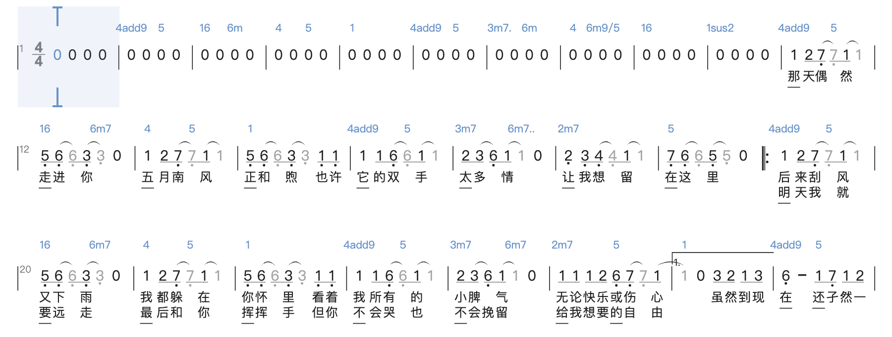

## SUSTech_CS202-Organization_2024s_Project-CPU

#### 小组成员：陈明志，邱天润，冯照航

> 源码托管于 GitHub，将在项目 ddl 结束后基于 **MIT License** 协议开源，访问链接：
>
> [https://github.com/RoderickQiu/CS202-Project](https://github.com/RoderickQiu/CS202-Project)

------

### 开发者说明

| 姓名       | 学号         | 负责内容                                                     | 贡献比 |
| ---------- | ------------ | ------------------------------------------------------------ | ------ |
| **陈明志** | **12211414** | CPU 硬件的实现和测试，测试场景1+2汇编代码，文档写作 | 1/3    |
| **邱天润** | **12210829** | CPU 硬件的实现和测试，七段数码管输出，VGA，软硬件协同案例，文档写作            | 1/3    |
| **冯照航** | **12210722** | CPU 硬件的实现和测试，扩展指令的实现和测试，文档写作        | 1/3    |

### 版本修改记录

主要几个版本迭代：

- 整体模块以及LED输入和七段数码显示管功能编写完毕 05/10
- 测试场景1+2汇编代码编写完毕 05/11
- 通过测试场景1的Simulation 05/12
- 同老师交流后修改部分时序逻辑的时钟错误：05/20
- 测试场景1通过 通过：05/20
- 测试场景1通过 通过：05/21
- OJ 通过：05/21
- VGA 功能及扩展指令版本：05/22
- 软硬件协同小程序：05/24

具体细节还可参考 GitHub 仓库提交记录。

------

### CPU 架构设计说明

#### 1. CPU特性：

- **ISA**：

| R-Type | opcode   | rs1      | rs2     | rd      | fun7   | fun3     | 使用方式                             | 举例              |
| ------ | -------- | ------- | ------- | ------- | ------- | -------- | ------------------------------------ | ----------------- |
| add    | `0110011` | rs1      | rs2      | rd      | `0000000` | `000` | rd <- **rs1 + rs2**                    | `add t0, x0, t1`  |
| sub    | `0110011` | rs1      | rs2      | rd      | `0100000` | `000` | rd <- **rs1 - rs2**                    | `sub t0, x0, t1`  |
| and    | `0110011` | rs1      | rs2      | rd      | `0000000` | `111` | rd <- **rs1 & rs2**                    | `and t0, x0, t1`  |
| or     | `0110011` | rs1      | rs2      | rd      | `0000000` | `110` | rd <- **rs1 \| rs2**                   | `or t0, x0, t1`   |
| xor    | `0110011` | rs1      | rs2      | rd      | `0000000` | `100` | rd <- **rs1 ^ rs2**                    | `xor t0, x0, t1`  |
| slt    | `0110011` | rs1      | rs2      | rd      | `0000000` | `010` | rd <- **(rs1 < rs2) ? 1 : 0**          | `slt t0, x0, t1`  |
| sll    | `0110011` | rs1      | rs2      | rd      | `0000000` | `001` | rd <- **rs1 << rs2**                | `sll t0, x0, t1`   |
| srl    | `0110011` | rs1      | rs2      | rd      | `0000000` | `101` | rd <- **rs1 >> rs2 (逻辑右移)**     | `srl t0, x0, t1`   |
| sra    | `0110011` | rs1      | rs2      | rd      | `010000`   | `101` | rd <- **rs1 >> rs2 (算术右移)**     | `sra t0, x0, t1`   |

| I-Type1 | opcode   | rs1      | rs2     | rd      | fun7   | fun3     | 使用方式                             | 举例              |
| ------ | -------- | ------- | ------- | ------- | ------- | -------- | ------------------------------------ | ----------------- |
| addi    | `0010011` | rs1      | imm | rd      | Null | `000` | rd <- **rs1 + imm**                    | `addi t0, t1, 2`  |
| xori    | `0010011` | rs1      | imm | rd      | Null | `100` | rd <- **rs1 ^ imm**                    | `xori t0, t1, 3`  |
| ori     | `0010011` | rs1      | imm | rd      | Null | `110` | rd <- **rs1 \| imm**                   | `ori t0, t1, 4`  |
| andi    | `0010011` | rs1      | imm | rd      | Null | `111` | rd <- **rs1 \& rs2**                   | `andi t0, t1, 5`   |
| slli    | `0010011` | rs1      | imm | rd      | `imm[11:5]=0x00` | `001` | rd <- **rs1 << imm\[4:0]**    | `slli t0, t1, 6`  |
| srli    | `0010011` | rs1      | imm | rd      | `imm[11:5]=0x00` | `101` | rd <- **rs1 >> imm\[4:0] (逻辑右移)**   | `srli t0, t1, 7`  |
| srai    | `0010011` | rs1      | imm | rd      | `imm[11:5]=0x20` | `101` | rd <- **rs1 >> imm\[4:0] (算术右移)**   | `srai t0, t1, 8`   |
| slti    | `0010011` | rs1      | imm | rd      | Null | `010` | rd <- **(rs1 < imm) ? 1 : 0**     | `slti t0, t1, 9`   |


| I-Type2 | opcode   | rs1      | rs2     | rd      | fun7   | fun3     | 使用方式                             | 举例              |
| ------ | -------- | ------- | ------- | ------- | ------- | -------- | ------------------------------------ | ----------------- |
| lb | `0000011` | rs1      | imm | rd      | Null | `000` | rd = **{24’bM\[rs1+imm][7],M\[rs1+imm][7:0]}** | `lb t0, 0(t1)`  |
| lh | `0000011` | rs1      | imm | rd      | Null | `001` | rd = **{16’bM\[rs1+imm][15],M\[rs1+imm][15:0]}** | `lh t0, 0(t1)`  |
| lw | `0000011` | rs1      | imm | rd      | Null | `010` | rd = **M\[rs1+imm][31:0]** | `lw t0, 0(t1)`  |

| S-Type | opcode   | rs1      | rs2     | rd      | fun7   | fun3     | 使用方式                             | 举例              |
| ------ | -------- | ------- | ------- | ------- | ------- | -------- | ------------------------------------ | ----------------- |
| sb | `0100011` | rs1      | imm | rd      | Null | `000` | **M\[rs1+imm][7:0]** = **rs2\[7:0]** | `sb t0, 0(t1)`  |
| sh | `0100011` | rs1      | imm | rd      | Null | `001` | **M\[rs1+imm][15:0]** = **rs2\[15:0]** | `sh t0, 0(t1)`  |
| sw | `0100011` | rs1      | imm | rd      | Null | `010` | **M\[rs1+imm][31:0]** = **rs2\[31:0]** | `sw t0, 0(t1)`  |


| B-Type | opcode   | rs1      | rs2     | rd      | fun7   | fun3     | 使用方式                             | 举例              |
| ------ | -------- | ------- | ------- | ------- | ------- | -------- | ------------------------------------ | ----------------- |
| beq | `1100011` | rs1      | rs2 | rd      | Null | `000` | **PC += (rs1 == rs2) ? {imm,1’b0} : 4** | `beq t0, t1, label`  |
| bne | `1100011` | rs1      | rs2 | rd      | Null | `001` | **PC += (rs1 != rs2) ? {imm,1’b0} : 4** | `bne t0, t1, label`  |
| blt | `1100011` | rs1      | rs2 | rd      | Null | `100` | **PC += (rs1 < rs2) ? {imm,1’b0} : 4** | `blt t0, t1, label`  |
| bge | `1100011` | rs1      | rs2 | rd      | Null | `101` | **PC += (rs1 >= rs2) ? {imm,1’b0} : 4** | `bge t0, t1, label`  |
| bltu | `1100011` | rs1      | rs2 | rd      | Null | `110` | **PC += (rs1(unsigned) < rs2(unsigned)) ? {imm,1’b0} : 4** | `bltu t0, t1, label`  |
| bgeu | `1100011` | rs1      | rs2 | rd      | Null | `111` | **PC += (rs1(unsigned) >= rs2(unsigned)) ? {imm,1’b0} : 4** | `bgeu t0, t1, label`  |

| J-Type | opcode   | rs1      | rs2     | rd      | fun7   | fun3     | 使用方式                             | 举例              |
| ------ | -------- | ------- | ------- | ------- | ------- | -------- | ------------------------------------ | ----------------- |
| jal    | `1101111` | NULL | imm | rd | NULL | NULL | **rd = PC + 4; PC += imm** | `jal t0, label` |
| jalr   | `1100111` | rs1 | imm | rd | NULL | NULL | **rd = PC + 4; PC = rs1 + imm** | `jalr t0, 0(t1)` |

| Bonus | opcode   | rs1      | rs2     | rd      | fun7   | fun3     | 使用方式                             | 举例              |
| ------ | -------- | ------- | ------- | ------- | ------- | -------- | ------------------------------------ | ----------------- |
| lui    | `0110111` | NULL | NULL | rd | NULL | NULL | **rd = imm << 12** | `lui t0, 0x80000` |
| auipc | `0010111` | NULL | NULL | rd | NULL | NULL | **rd = PC + imm << 12** | `auipc t0, 0x80000` |
| ecall | `1110011`| NULL | NULL | NULL | `0000000`| `000` |**r7 = 0 在LED上输出a0** **r7 = 1 读入Switch上读入值储存到a0**| `ecall` |

- 参考的 ISA：**MiniSys-1A，RISCV**

- 寻址空间设计：使用了哈佛结构。指令中寻址单位为字节，实际中以字为数据位宽，即指令空间和数据空间读写位宽均为 **32 bits**，读写深度均为 **16384**

- 外设 IO 支持：软硬件协同以实现功能，采用 MMIO 外设。Switch LED对应的寻址范围的前四位都为0xFFFF, 后四位分别为1111_1100_000x_xx00和1111_1100_001x_xx00, 下列表格展示了不同xxx组合的不同功能。

  | IO设备         | xxx 3bit |
  | ------------------- | ----------- |
  | Switch 输入 24位`unsigned`   | `100`|
  | Switch 输入 中间8位`signed`   |  `101`     |
  | Switch 输入 右边8位`signed`  | `001`        |
  | Switch 输入 右边16位`unsigned`   | `110`|
  | Switch 输入 右边12位`unsigned`   | `111`|
  | LED 输出 右边16位 | `100`       |
  | LED 输出 中间8位 | `101`         |
  | LED 输出 右边8位 | `110`        |
  | LED 输出 右边12位 | `111`        |
  | 七段数码显示输出    | 绑定对应的Register  |
  | VGA 输出            | 绑定对应的Register  |

- CPU 为单周期 CPU，CPI 接近为 1，不支持 Pipeline

#### 2.CPU 接口：

#### LED引脚定义：

| 引脚 | 规格     | 名称         | 功能         |
| ---- | -------- | ------------ | ------------ |
| K17  | `output` | `led2N4[23]` | LED 引脚 23  |
| L13  | `output` | `led2N4[22]` | LED 引脚 22  |
| M13  | `output` | `led2N4[21]` | LED 引脚 21  |
| K14  | `output` | `led2N4[20]` | LED 引脚 20  |
| K13  | `output` | `led2N4[19]` | LED 引脚 19  |
| M20  | `output` | `led2N4[18]` | LED 引脚 18  |
| N20  | `output` | `led2N4[17]` | LED 引脚 17  |
| N19  | `output` | `led2N4[16]` | LED 引脚 16  |
| M17  | `output` | `led2N4[15]` | LED  引脚 15 |
| M16  | `output` | `led2N4[14]` | LED 引脚 14  |
| M15  | `output` | `led2N4[13]` | LED 引脚 13  |
| K16  | `output` | `led2N4[12]` | LED 引脚 12  |
| L16  | `output` | `led2N4[11]` | LED 引脚 11  |
| L15  | `output` | `led2N4[10]` | LED 引脚 10  |
| L14  | `output` | `led2N4[9]`  | LED 引脚 9   |
| J17  | `output` | `led2N4[8]`  | LED 引脚 8   |
| F21  | `output` | `led2N4[7]`  | LED 引脚 7   |
| G22  | `output` | `led2N4[6]`  | LED 引脚 6   |
| G21  | `output` | `led2N4[5]`  | LED 引脚 5   |
| D21  | `output` | `led2N4[4]`  | LED 引脚 4   |
| E21  | `output` | `led2N4[3]`  | LED 引脚 3   |
| D22  | `output` | `led2N4[2]`  | LED 引脚 2   |
| E22  | `output` | `led2N4[1]`  | LED 引脚 1   |
| A21  | `output` | `led2N4[0]`  | LED 引脚 0   |

#### 开关引脚定义：

| 引脚 | 规格    | 名称            | 功能        |
| ---- | ------- | --------------- | ----------- |
| Y9   | `input` | `switch2N4[23]` | 开关引脚 23 |
| W9   | `input` | `switch2N4[22]` | 开关引脚 22 |
| Y7   | `input` | `switch2N4[21]` | 开关引脚 21 |
| Y8   | `input` | `switch2N4[20]` | 开关引脚 20 |
| AB8  | `input` | `switch2N4[19]` | 开关引脚 19 |
| AA8  | `input` | `switch2N4[18]` | 开关引脚 18 |
| V8   | `input` | `switch2N4[17]` | 开关引脚 17 |
| V9   | `input` | `switch2N4[16]` | 开关引脚 16 |
| AB6  | `input` | `switch2N4[15]` | 开关引脚 15 |
| AB7  | `input` | `switch2N4[14]` | 开关引脚 14 |
| V7   | `input` | `switch2N4[13]` | 开关引脚 13 |
| AA6  | `input` | `switch2N4[12]` | 开关引脚 12 |
| Y6   | `input` | `switch2N4[11]` | 开关引脚 11 |
| T6   | `input` | `switch2N4[10]` | 开关引脚 10 |
| R6   | `input` | `switch2N4[9]`  | 开关引脚 9  |
| V5   | `input` | `switch2N4[8]`  | 开关引脚 8  |
| U6   | `input` | `switch2N4[7]`  | 开关引脚 7  |
| W5   | `input` | `switch2N4[6]`  | 开关引脚 6  |
| W6   | `input` | `switch2N4[5]`  | 开关引脚 5  |
| U5   | `input` | `switch2N4[4]`  | 开关引脚 4  |
| T5   | `input` | `switch2N4[3]`  | 开关引脚 3  |
| T4   | `input` | `switch2N4[2]`  | 开关引脚 2  |
| R4   | `input` | `switch2N4[1]`  | 开关引脚 1  |
| W4   | `input` | `switch2N4[0]`  | 开关引脚 0  |

#### 其他引脚定义：

| 引脚 | 规格     | 名称       | 功能      |
| ---- | -------- | ---------- | --------- |
| Y18  | `input` | `clk_in`    | FPGA 时钟 |
| P20  | `input` | `fpga_rs1t` | FPGA 复位 |

#### VGA与七段数码管引脚定义

| 引脚 | 规格     | 名称         | 功能                   |
| ---- | -------- | ------------ | ---------------------- |
| H15  | `output` | `r[3]`  | VGA 红色输出引脚 3            |
| J15  | `output` | `r[2]`  | VGA 红色输出引脚 2            |
| G18  | `output` | `r[1]`   | VGA 红色输出引脚 1            |
| G17  | `output` | `r[0]`   | VGA 红色输出引脚 0            |
| H22  | `output` | `g[3]`   | VGA 绿色输出引脚 3       |
| J22  | `output` | `g[2]`   | VGA 绿色输出引脚 2        |
| H18  | `output` | `g[1]`   | VGA 绿色输出引脚 1      |
| H17  | `output` | `g[0]`   | VGA 绿色输出引脚 0        |
| K22  | `output` | `b[3]`   | VGA 蓝色输出引脚 3         |
| K21  | `output` | `b[2]`   | VGA 蓝色输出引脚 2         |
| G20  | `output` | `b[1]`   | VGA 蓝色输出引脚 1           |
| H20  | `output` | `b[0]`   | VGA 蓝色输出引脚 0           |
| M21  | `output` | `hs`       | 水平同步信号           |
| L21  | `output` | `vs`       | 垂直同步信号           |
| C19  | `output` | `tub_sel[0]`  | 数码管使能引脚 0       |
| E19  | `output` | `tub_sel[1]`  | 数码管使能引脚 1       |
| D19  | `output` | `tub_sel[2]`  | 数码管使能引脚 2       |
| F18  | `output` | `tub_sel[3]`  | 数码管使能引脚 3       |
| E18  | `output` | `tub_sel[4]`  | 数码管使能引脚 4       |
| B20  | `output` | `tub_sel[5]`  | 数码管使能引脚 5       |
| A20  | `output` | `tub_sel[6]`  | 数码管使能引脚 6       |
| A18  | `output` | `tub_sel[7]`  | 数码管使能引脚 7       |
| F15  | `output` | `seg_out[0]` | 数码管输出引脚 0       |
| F13  | `output` | `seg_out[1]` | 数码管输出引脚 1       |
| F14  | `output` | `seg_out[2]` | 数码管输出引脚 2       |
| F16  | `output` | `seg_out[3]` | 数码管输出引脚 3       |
| E17  | `output` | `seg_out[4]` | 数码管输出引脚 4       |
| C14  | `output` | `seg_out[5]` | 数码管输出引脚 5       |
| C15  | `output` | `seg_out[6]` | 数码管输出引脚 6       |
| E13  | `output` | `seg_out[7]` | 数码管输出引脚 7       |

- 时钟：在本 CPU 中使用到了开发板提供的 100MHz 时钟 `Y18` ，通过 IP 核分别转化成为了  6MHz（供单周期 CPU 使用）、25MHz（供dmem32使用）以及 0.5Hz （供 测试场景2-111 使用），占空比为 50% 的周期时钟信号。
- 复位：使用异步复位，我们通过高电位信号来判断复位信号并通过开发板的按钮外设来控制复位信号的输入。在按下复位按钮之后，   CPU 将会重新回到初始状态，之前的所有状态将会被清空。
- 开关输入接口：除了之前已经提到过的开关之外，我们还实现了其他开关的接口。其中 `switch2N4[21]` 至 `switch2N4[23]`（高 8 位中的高 3 位）用来控制测试样例编号的输入，支持编号 0B000-0B111 的输入。`switch2N4[20]`用于判断是否执行audio。拨码开关的中 8 位和低 8 位则根据测试样例的不同，用于输入测试数据 a 或 b，或者运算结果 。 (具体的端口绑定请看 `xdc.xdc` 文件)
- LED 灯输出：23 号显示当前的rst，22号灯显示cpu的clk信号，16~21号灯显示pc>>2，0-15 号 LED 灯来作为计算结果的显示，若为 1 则亮灯，反之不亮。同时使用 `led2N4[0:7]` 来作为判断的指示信号灯，若判断关系成立则亮灯，反之不亮。(具体的端口绑定请看 `xdc.xdc` 文件)
- 七段数码显示管：在实现小键盘的基础上，为了输入的可视性，我们另实现了七段数码显示管接口，在左边四位可以展示运算结果，而在右边四位实时显示这是第几个结果（从0开始）（十六进制数）。 (具体的端口绑定请看 `xdc.xdc` 文件)
- VGA 输出：接受来自 IO 给定的模式选择信号，通过储存好的字阵选择信号输出对应的模式。

#### 3.CPU 内部结构（配图仅供参考，端口以表格为准）：
项目结构
```shell
├── imports
│   ├── led.sv
│   └── switch.sv
├── ip
│   ├── dmem32
│   ├── prgrom_1
└── new
    ├── cpu.v
    ├── stage_if.v
    ├── stage_id.v
    ├── stage_ex.v
    ├── stage_mem.v
    ├── alu_control.v
    ├── instruction_control.v
    ├── parse_instruction.v
    ├── register.v
    ├── mem_or_io.v
    ├── audio.v
    ├── define.v
    ├── print.v
    ├── seg.sv
    ├── vga.v
    └── vga_char_set.v
```
- [CPU](cpu.srcs/sources_1/new/cpu.v)

  CPU 顶层模块，集成了 CPU 各组件及 IO 外设。

| 端口名称          | 功用描述                                     |
| ----------------- | -------------------------------------------- |
| `sample`           | 例子   |

以下是 CPU 内部重要 `wire` 的解释
| wire 名称         | 功用描述                                           |
| ----------------- | -------------------------------------------------- |
| `sample`           | 例子   |

- [Stage IF](cpu.srcs/sources_1/new/stage_if.v)

  Instruction Fetch: 负责指令的获取以及 PC 的更新。
| 端口名称          | 功用描述                                     |
| ----------------- | -------------------------------------------- |
| `sample`           | 例子   |

以下是 Stage IF 内部重要 `wire` 的解释
| wire 名称         | 功用描述                                           |
| ----------------- | -------------------------------------------------- |
| `sample`           | 例子   |

- [Stage ID](cpu.srcs/sources_1/new/stage_id.v)

  Instruction Decode: 负责指令的解析以及寄存器的读取。

| 端口名称          | 功用描述                                     |
| ----------------- | -------------------------------------------- |
| `sample`           | 例子   |

以下是 Stage ID 内部重要 `wire` 的解释
| wire 名称         | 功用描述                                           |
| ----------------- | -------------------------------------------------- |
| `sample`           | 例子   |

- [Stage EX](cpu.srcs/sources_1/new/stage_ex.v)

    Execute: 负责指令的执行ALU以及计算。

| 端口名称          | 功用描述                                     |
| ----------------- | -------------------------------------------- |
| `sample`           | 例子   |

以下是 Stage EX 内部重要 `wire` 的解释
| wire 名称         | 功用描述                                           |
| ----------------- | -------------------------------------------------- |
| `sample`           | 例子   |

- [Stage MEM](cpu.srcs/sources_1/new/stage_mem.v)

    Memory: 负责数据的读写以及数据的存储。

| 端口名称          | 功用描述                                     |
| ----------------- | -------------------------------------------- |
| `sample`           | 例子   |

以下是 Stage MEM 内部重要 `wire` 的解释
| wire 名称         | 功用描述                                           |
| ----------------- | -------------------------------------------------- |
| `sample`           | 例子   |

- [ALU Control](cpu.srcs/sources_1/new/alu_control.v)

    ALU 控制模块: 负责 ALU 控制信号的生成。

| 端口名称          | 功用描述                                     |
| ----------------- | -------------------------------------------- |
| `aluop`   输入        | 从Instruction Control中获取对应的Instruction Type|
| `func7`   输入        | 辅助决定运算类型(ADD XOR AND 等)|
| `func3`    输入       | 辅助决定运算类型(ADD XOR AND 等)|
| `alu_ctrl`    输出       | 输出最终的运算类型(ADD XOR AND 等)|


- [Instruction Control](cpu.srcs/sources_1/new/instruction_control.v)

    指令控制模块: 负责指令控制信号的生成。

| 端口名称          | 功用描述                                     |
| ----------------- | -------------------------------------------- |
| `opcode`   输入        | 该命令的opcode  |
| `func3`   输入        | 该命令的func3  |
| `rst`     输入      | 复位信号 |
| `Branch`     输出     | 是否为Branch指令 |
| `MemRead`     输出     | 是否需要读内存 |
| `MemWrite`     输出     | 是否需要写内存 |
| `MemtoReg`     输出     | 是否需要写寄存器 |
| `RegWrite`     输出     | 是否需要写寄存器 |
| `ALUSrc`     输出     | 是否需要立即数 |
| `ALUOp`     输出     | ALU运算类型 |
| `Jump`     输出     | 是否为Jump指令 |
| `JR`     输出     | 是否为JumpReg指令|
| `signed`     输出     | 是否为有符号数|


- [Parse Instruction](cpu.srcs/sources_1/new/parse_instruction.v)

    指令解析: 负责指令的解析。提取rs1, rs2, imm, rd等字段。

| 端口名称          | 功用描述                                     |
| ----------------- | -------------------------------------------- |
| `Instruction 输入`           | 输入指令   |
| `rs1`     输出        | rs1  |
| `rs2`     输出        | rs2  |
| `imm`     输出        | imm  |
| `rd`     输出        | rd
| `opcode`     输出        | opcode  |
| `func3`     输出        | func3  |
| `func7`     输出        | func7


- [Register](cpu.srcs/sources_1/new/register.v)

    寄存器: 负责寄存器的读写。

| 端口名称          | 功用描述                                     |
| ----------------- | -------------------------------------------- |
| `id1` 输入     | rs1编号 |
| `id2` 输入 | rs2编号 |
| `idwr` 输入 | rd编号 |
| RegWrite 输入 |  |
| clk 输入 |  |
| rst 输入 |  |
| mem_to_reg |  |
| mem_write_addr |  |
|  |  |

以下是 Register 内部重要 `wire` 的解释
| wire 名称         | 功用描述                                           |
| ----------------- | -------------------------------------------------- |
| `sample`           | 例子   |

- [Switch and LED](cpu.srcs/sources_1/new/mem_or_io.v)

    Switch and LED: 负责 Switch 和 LED 的读写。

| 端口名称          | 功用描述                                     |
| ----------------- | -------------------------------------------- |
| `sample`           | 例子   |

以下是 Switch and LED 内部重要 `wire` 的解释
| wire 名称         | 功用描述                                           |
| ----------------- | -------------------------------------------------- |
| `sample`           | 例子   |

### 测试说明

#### 测试总说明

| 内容         | 解释                                                         | 备注                             |
| ------------ | ------------------------------------------------------------ | -------------------------------- |
| 测试方法     | 在 CPU 硬件，OJ 和波形仿真通过后直接上板测试汇编代码         | 硬件模块均为此种测试方法         |
| 测试类型     | OJ 单元测试，之后均为集成测试，最后 CPU 顶层联合汇编文件测试 | 在完成主要功能后再单独测试 Bonus |
| 测试用例描述 | 见下文                                                       | 详细阐释汇编原理                 |
| 测试结论     | 见下文                                                       | 不一一展开，进行总体陈述         |

#### .asm文件详细描述

##### 1. 如何实现IO模块，与用户交互
    通过Switch进行输入，通过LED 七段数码管以及VGA进行输出
    最左边1-3位Switch输入测试样例编号, 如若需要输入2个数字,则中间8位Switch输入第一个数字,右边8位Switch输入第二个数字,一个数字则可以选择16位signed或者unsigned输入。
    通过按RST按钮进行复位。
    LED的输出根据不同的测试样例有所不同,会在下面详细说明。
##### 2. 如何实现通过 七段数码管 进行调试
    将PC或者Register与七段数码管绑定,可以检验数据是否存进寄存器或者从寄存器中读出正确的数据，从而调整修正各个模块的时序问题。
##### 3. 测试场景自测试
|测试用例|测试方法|测试类型|测试用例描述|测试结果|
| --- | --- | --- | --- | --- |
| `1-1` | 仿真+上板 | 单元 | 输入`a = 4` `b = 5`| 测试通过 |
| `1-2` | 仿真+上板 | 单元 | 输入`a = 128`输出`a = -128(补码)` | 测试通过 |
| `1-3` | 仿真+上板 | 单元 | 输入`a = 128`输出`a = 128(补码)` | 测试通过 |
| `1-4` | 仿真+上板 | 单元 | 输入`a = 4` `b = 5` LED熄灭 输入`a = 4` `b = 4` LED 亮灯| 测试通过 |
| `1-5` | 仿真+上板 | 单元 | 输入`a = 4` `b = 5` LED亮灯 输入`a = 5` `b = 255(因为是signed 所以其实是-1)` LED 熄灭| 测试通过 |
| `1-6` | 仿真+上板 | 单元 | 输入`a = 4` `b = 5` LED熄灭 输入`a = 5` `b = 4` LED 亮灯| 测试通过 | 
| `1-7` | 仿真+上板 | 单元 | 输入`a = 4` `b = 255` LED亮灯 输入`a = 255(因为是signed 所以就是255)` `b = 4` LED 熄灭| 测试通过| 测试通过 | 
| `1-8` | 仿真+上板 | 集成 | 输入`a = 4` `b = 255` LED熄灭 输入`a = 255(因为是signed 所以就是255)` `b = 4` LED 亮灯| 测试通过| 测试通过 |
| `2-1` | 仿真+上板 | 集成 | 输入`a = 00000100` 输出前导零个数为`5` | 测试通过 |
| `2-2` | 仿真+上板 | 集成 | 输入`a = 0x5ba0` 输出 `245` | 测试通过 |
| `2-3` | 仿真+上板 | 集成 | 输入`a = 0x5ba0` 输出 `244` | 测试通过 |
| `2-4` | 仿真+上板 | 集成 | 输入`a = 0x5ba0` 输出 `244`  | 测试通过 |
| `2-5` | 仿真+上板 | 集成 | 输入`a = 9 b = 10` 输出 `236` | 测试通过 |
| `2-6` | 仿真+上板 | 集成 | 输入`a = 001011001010` 输出`010100110100`| 测试通过 |
| `2-7` | 仿真+上板 | 集成 | 输入`a = 8` 输出`66` | 测试通过 |
| `2-8` | 仿真+上板 | 集成 | 输入`a = 2` 输出`1 1 2 1 1 0 1 2`这8个数字| 测试通过 |
##### 4. 依次显示入栈（出栈）的参数，每个参数显示停留 2-3 秒（此处以显示入栈参数为例）
    在Mem中制定一块内存地址，在每一次入栈出栈的时候，将参数存入指定的地址并且储存地址+4，然后当程序跑完后，七段数码管依次读取内存中的信息。
#### 测试结论：

总体来说，我们的测试高度模块化，每个人基于自己的部分各自进行测试，最后再汇总。CPU 核心模块的测试和改正基于 OJ 和课件等进行参考，在通过 OJ 测试后基本宣告功能可用。汇编部分代码过长不在这里详细展示，具体可以参考附件。

而外设部分的测试，因为开关和的 LED 的功能较为简单，我们基于 CPU 硬件中 MemIO 模块的完成后直接结合场景 1 汇编进行测试。测试有效后通过模块化的方式，核心部分修改 MemIO，再分别编写、测试、增添新外设模块。最后再进行集成测试。但是其实整体过程并不顺利，出现了很多时序的问题，最后将很多时序逻辑改为用`assign`的方式，解决了很多问题。

### 问题及总结

#### 问题：

- 读寄存器，以及写寄存器的时候，因为时序问题，导致ALU算出的数据不能写入寄存器
  - 最后通过看课件，发现了时序问题，将读写分别放在了时钟的上升沿和下降沿，并且将部分参数改为了用assign赋值的方式，解决了时序问题。
- 场景 1 有符号数字比较无从下手
  - 想到硬件符号拓展的原理，直接用软件的方式将 8 位的有效数据根据最高位拓展为 32 位满的有效数据
- 认为自己完成了正确的汇编编写，模块测试也通过，但是上板之后没办法正常运行。
  - 原来是忘记了启动程序要按复位键
- 上板测试的时候，和simulation发现的结果不一样，但是时钟clk速度过快无法看过程中的信息进行调试。
  - 更改clk，使得1s只跑一条指令，然后和rars上的结果进行逐条对比分析。
- 测试场景2中因为涉及递归，发现对sp寄存器的处理有问题并且没有实现ra命令
  - 在define里增加常量，对sp寄存器进行初始化并且实现ra命令。

#### 总结：

这一段漫长浩大的工程终于要落下帷幕。在这3个星期里参与这次项目的队友们都没少熬大夜。

对于本次项目，一个明显的感受就是由易、到难，再到了然：先是觉得通过理论课 datapath 明晰的学习和实验课提供的框架，完成这个项目只是时间问题。后来发现在自己编写的过程中会遇见大大小小的问题，包括代码组织，开发环境配置，各个结构之间的协调，等等等等。最严重的问题莫过于摸不着头脑的测试环节：你就是发现了问题，但是搞不清楚它可能发生在哪里，只好一个个试。加上跑一个bitstream到后期需要半个多小时，导致整一个调试过程变得非常冗长。

最后，当经历了所有工程之后，对于单周期 CPU 的编写过程已经基本了然于心，每一行代码都十分熟悉，更加深了对简单的单周期 CPU 的理解。同时，也对于硬件的设计有了更深的认识，对于时序逻辑的设计也有了更深的认识。

------

### Bonus 对应功能点的设计说明

#### 1. 实现扩展指令
##### lui的实现
将立即数左移12位，然后存入rd寄存器，在我们的测试样例中，我们将Switch以及LED的地址，通过lui命令+addi命令导入寄存器，然后通过lw命令读取内存，最后通过sw命令将输出存入内存中。

其中的核心代码如下：

```assembly
    #switch:1111_1100_000x_xx00
	#led:1111_1100_001x_xx00
	lui t2, 0x1
    lui t0, 0xfffff
    addi t0, t0, -1024
    add t0, t0, t2
    lui t1, 0xfffff
    addi t1, t1, -992
    add t1, t1, t2
```

##### auipc的实现
将PC左移12位，然后存入rd寄存器，在我们的测试样例中，我们将Switch以及LED的地址，通过auipc命令+addi命令导入寄存器，然后通过lw命令读取内存，最后通过sw命令将输出存入内存中。

其中的核心代码如下：

```assembly
.data
	Switch: .word 0xfffffc00
	Led: .word 0xfffffc10
.text
	auipc x5, 0x0000fc10
	addi x5, x5, 0
	auipc x6, 0x0000fc10
	addi x6, x6, 0xfffffffc 
```
##### ecall的实现

ecall指令是一个系统调用指令，用于在用户态和内核态之间进行切换。在我们的测试样例中， 当`a7 = 0`的时候，调用用ecall指令便会从Switch中读取数据并且储存到a0寄存器当中，当`a7 = 1`的时候，调用ecall指令便会从a0寄存器中读取值并且通过LED的方式输出出来。

其中的核心代码如下：

```assembly
    li a7, 0
    ecall
    li a7, 1
    ecall
```

#### 2. 实现对复杂外设接口的支持

##### 七段数码管：

该模块的功能是控制数码管的显示，通过分频器将输入的时钟信号分频，以控制数码管刷新的频率。使用计数器进行选择，依次显示输入数据的不同部分。通过输出的 `tub_sel` 信号选择当前显示的数码管，通过 `seg_out` 输出对应数码管上的数据。利用视觉暂留，使得八位都可以显示数字。

| 端口名称  | 功用描述         |
| --------- | ---------------- |
| `clk`     | 时钟信号输入     |
| `rst`     | 复位信号输入     |
| `val`  | 输入的 32 位显示数值 |
| `tub_sel`  | 8 位使能信号输出 |
| `seg_out` | 8 位段码输出     |

其中核心代码如下：

```verilog
always @(*) begin
    case (divider_clk)
        3'b000: begin
            tub_sel = ~8'b00000001;
            seg_in = p0;
        end
        3'b001: begin
            tub_sel = ~8'b00000010;
            seg_in = p1;
        end
        3'b010: begin
            tub_sel = ~8'b00000100;
            seg_in = p2;
        end
        3'b011: begin
            tub_sel = ~8'b00001000;
            seg_in = p3;
        end
        3'b100: begin
            tub_sel = ~8'b00010000;
            seg_in = p4;
        end
        3'b101: begin
            tub_sel = ~8'b00100000;
            seg_in = p5;
        end
        3'b110: begin
            tub_sel = ~8'b01000000;
            seg_in = p6;
        end
        3'b111: begin
            tub_sel = ~8'b10000000;
            seg_in = p7;
        end
        default: tub_sel = ~8'b00000000;
    endcase
end
```

##### VGA：

该模块的功能是控制 VGA 的显示。读入输入的信息，转化为阵列字体的信号，存在一个个字符格（`vga_char_set`）中，并进行二维扫描，在 VGA 信号扫描到对应亮起的像素点时输出 RGB 全 1 信号（白色）。

| 端口名称  | 功用描述                                |
| --------- | --------------------------------------- |
| `clk`     | VGA 模块时钟，使用 FPGA 时钟            |
| `rst`     | VGA 模块复位信号                        |
| `val` | VGA 的数据输入信号 |
| `r`, `g`, `b`     | VGA 的 RGB 颜色信号，各 4 位                |
| `hs`      | 水平同步信号                            |
| `vs`      | 垂直同步信号                            |

```verilog
//analyze and get output, for 1 being lit up
always @(posedge pclk or posedge rst) begin
    if (rst) begin
        r <= 0;
        g <= 0;
        b <= 0;
    end
    else if (vcount>=UP_BOUND && vcount<=DOWN_BOUND
             && hcount>=LEFT_BOUND && hcount<=RIGHT_BOUND) begin
        if (hcount >= left_pos && hcount <= right_pos) begin
            if (vcount >= up_pos_0 && vcount <= down_pos_0) begin
                if (p0[hcount-left_pos][vcount-up_pos_0]) begin
                    r <= 4'b1111;
                    g <= 4'b1111;
                    b <= 4'b1111;
                end else begin
                    r <= 4'b0000;
                    g <= 4'b0000;
                    b <= 4'b0000;
                end
            end else begin
                r <= 4'b0000;
                g <= 4'b0000;
                b <= 4'b0000;
            end
        end else begin
            r <= 4'b0000;
            g <= 4'b0000;
            b <= 4'b0000;
        end
    end else begin
        r <= 4'b0000;
        g <= 4'b0000;
        b <= 4'b0000;
    end
end
```

下面是控制模块的核心代码：

```verilog
//control data from val
always @(posedge clk, posedge rst) begin
    if (rst) begin
        data0 <= 35'b0;  //reset, all zero
    end else begin
        data0[35:30] <= val[23:20];
        data0[29:24] <= val[19:16];
        data0[23:18] <= val[15:12];
        data0[17:12] <= val[11:8];
        data0[11:6]  <= val[7:4];
        data0[5:0]   <= val[3:0];
    end
end
```

在项目中，我们可以测试到 VGA 的显示效果，可以显示出我们想要的字符。

#### 3. 基于CPU的软硬件协同的实现或应用

##### 可匹配生成 ROM / RAM 大小可调整的 coe 文件创建工具

在我们的项目中，我们利用 Python 实现了一个可以调整对应内存大小（depth）的小工具，可以从 Rars 生成的 `inst.txt` 或 `dmem.txt` 出发，生成出大小不同的 coe 文件。

核心代码罗列如下。在这段代码中，我们先输出 coe 的通用头，然后按行输出，并在后面补 0，并在最后一行输出 `;` 标志文件结束。

这一代码的使用方法为在终端中输入`python coe-gen.py <from_file> <to_file> <depth>`。

```python
# Open the file to write the .coe file
with open(to_file, "w") as f:
    # Write the header
    f.write("memory_initialization_radix = 16;\n")
    f.write("memory_initialization_vector=\n")

    # Write the instructions, and if the required depth is longer than the instructions, fill the rest with 0
    for i in range(depth):
        if i != depth - 1:
            if i < len(instructions):
                f.write(instructions[i].strip() + ",\n")
            else:
                f.write("00000000,\n")
        else:
            if i < len(instructions):
                f.write(instructions[i].strip() + ";\n")
            else:
                f.write("00000000;\n")
```

将这一工具与 Rars 结合，我们可以生成出不同大小的 coe 文件，以适应不同的内存大小。对 Rars 输出的文件进行测试，我们可以发现生成的 coe 文件的大小是可以调整的。

##### 可以与CPU进行通信并配合的软件应用：音乐播放器

我们用软硬件结合的方式实现了音乐播放器功能。

通过使用 `scenario/test_audio.asm` 对应的 coe 文件，可以从汇编文件的 `.data` 区中读取对应的音频信号，并在蜂鸣器中输出。整个功能是通过软硬件结合的方式实现的，具体来说是 CPU 的 MemIO 模块，蜂鸣器模块和 RISC-V 汇编代码（功能是在每个时钟周期输出对应的当前音符值，用于在硬件层面输出）。

汇编代码如下：

```assembly
main:
    lui s1, 0x1
    addi t4, zero, 15

    # audio init
    lui t2, 0xfffff
    addi t2, t2, -768
    add t2, t2, s1
    
    # melody init
    addi t3, zero, 4

loop:
    lw t1, 0(t3)
    beq t1, t4, exit_loop  # if t1 == 15, exit loop

    lw a0, 0(t3)
    sw a0, 0(t2)

    # next note
    addi t3, t3, 4
    addi t2, t2, 4

    j loop
    
exit_loop:
```

我们的音频格式定义如下：

- 一个 word 代表一个音符，用 1-14 的数字表示音符，0 代表休止符，15 代表结束符
- 各个音符之间使用英文逗号 `,` 分隔
- 一个 word 代表 1/4 拍
- 数字 1 代表低音 do，数字 2 代表低音 re，以此类推，数字 14 代表中音 si。

此外，为了正常播放音乐，我们在两个音符之间插入了一个休止符，以保证音符的独立性。

我们在示例中播放了毛不易《二零三》的选段，为：

```
8, 0, 9, 0, 7, 0, 8, 0, 5, 0, 6, 0, 3, 0, 0, 0, 8, 0, 9, 0, 5, 0, 8, 0, 5, 0, 6, 0, 3, 0, 1, 0, 1, 0, 8, 0, 8, 0, 6, 0, 8, 0, 9, 0, 10, 0, 8, 0, 0, 0, 2, 0, 3, 0, 4, 0, 8, 0, 7, 0, 6, 0, 5, 0, 0, 0, 8, 0, 9, 0, 7, 0, 8, 0, 5, 0, 6, 0, 3, 0, 8, 0, 9, 0, 7, 0, 8, 0, 5, 0, 6, 0, 3, 0, 1, 0, 8, 0, 6, 0, 8, 0, 9, 0, 10, 0, 5, 0, 8, 0, 0, 0, 8, 0, 8, 0, 8, 0, 9, 0, 6, 0, 7, 0, 8, 0, 15
```

对应的曲谱为：

在这个音乐播放器中，我们通过读取内存中的音符（`stage_mem`中），将其转化为对应的频率，然后通过蜂鸣器输出。

音乐输出的相关代码为：

```verilog
always @(posedge clk) begin
    if(rst) begin
        cur_half_period_count <= 0;
        buzzer <= 0;
    end else begin
        if(cur_half_period_count >= cur_half_period) begin
            cur_half_period_count <= 0;
            buzzer <= ~buzzer;
         end
        else cur_half_period_count <= cur_half_period_count + 1;
    end
end

always @(*) begin
    case(cur_note)
        4'd0 : cur_half_period = silence; // 0000
        4'd1 : cur_half_period = do_low; // 0001
        4'd2 : cur_half_period = re_low; // 0010
        4'd3 : cur_half_period = me_low; // 0011
        4'd4 : cur_half_period = fa_low; // 0100
        4'd5 : cur_half_period = so_low; // 0101
        4'd6 : cur_half_period = la_low; // 0110
        4'd7 : cur_half_period = si_low; // 0111
        4'd8 : cur_half_period = do; // 1000
        4'd9 : cur_half_period = re; // 1001
        4'd10 : cur_half_period = me; // 1010
        4'd11 : cur_half_period = fa; // 1011
        4'd12 : cur_half_period = so; // 1100
        4'd13 : cur_half_period = la; // 1101
        4'd14 : cur_half_period = si; // 1110
        default : cur_half_period = silence;
    endcase 
end
```

这段代码中，我们通过从 `stage_mem` 中输出的 `cur_note` 选择当前的音符，然后通过 `cur_half_period` 选择当前的频率，最后通过 `buzzer` 输出这一频率。于此同时，会在七段数码管上显示当前的音符。

另外，由于音乐播放器需要比较快地输出来保证音乐的连贯性，我们使用了和结果输出不同的时钟信号，以保证音乐的输出。启用这一时钟信号需要将第 20 个开关打开。

##### 音乐格式自动生成器

我们通过 Python 编写了一个音乐格式自动生成器，可以根据输入的人类可读的音乐谱，生成对应的音乐格式。这个音乐格式可以直接复制到汇编代码中，用于播放音乐。

我们约定音乐谱使用这些音符：

```
do_low, re_low, mi_low, fa_low, so_low, la_low, si_low, do, re, mi, fa, so, la, si
```

其中，`do_low` 代表低音 do，`re_low` 代表低音 re，以此类推，`si` 代表中音 si。每行一个。

相关 Python 代码如下：

```python
notes = []
for line in lines:
    notes.append(line.strip())

output = ""
for note in notes:
    if note == "do_low":
        output += "1, "
    elif note == "re_low":
        output += "2, "
    elif note == "mi_low":
         output += "3, "

......         
```

相关代码会将输入的音乐谱转化为对应的音乐格式，然后输出到终端，如前述的《二零三》的音乐格式就是通过这个工具生成的。

这个工具的使用方法为在终端中输入`python music-gen.py <from_file>`。


### Bonus 问题与总结

#### 问题：

- 七段数码显示管显示数字重叠
  - 由数码管选择信号变化频率过快导致，由于选择信号频率变化过快，数码管无法快速反映出选择信号的变化，所以同时显示三个数字的七段数码信号。将其由系统时钟分频为周期为 2ms 左右的时钟后解决。
- auipc命令需要用到data memory，但是在verilog里第一个word的内容默认从地址1开始， 但是rars里是从0开始，所以需要在前面垫1个空的全0的word.
- 修改自己以前写的 VGA 模块后发现不显示内容，按下复位按钮才有信号
  - 忘记本次 CPU 是复位高电平有效，更改复位信号敏感值和敏感沿后解决
- VGA 在显示时非显示区域也会有一些显示
  - 由于没有根据显示的字数规定好显示边界导致，重新设定好边界后解决

#### 总结：

我们在本次项目中主要实现了一些外设模块，由于功能高度模块化而可以各自根据自己功能分别展开测试，这样保证了基本功能可以实现和验证。在基本功能验证成功后只要结合汇编和硬件的 MemIO 模块设置控制信号，就能很快地完成对接。最后即使在对接时出现了一些小问题，也能根据整体的架构很快地定位到问题所在并修改。这就是模块化功能带来的极大好处。

Verilog 是一种硬件语言，相对于高级的软件语言，它有自己的特点。硬件相比于纯软件的特点：就是有时钟信号。很多令人匪夷所思，怀疑人生的 bug，其实就是因为忽略了时钟信号的存在。下次遇到 bug 可以先检查一下时序逻辑块。

------

### 项目报告到此结束，感谢您的阅读！

